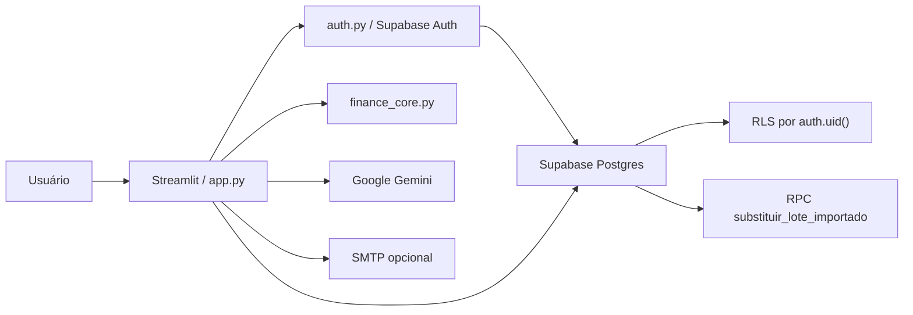

# Finanças Pro IA

Aplicação de analytics financeiro pessoal construída com **Python, Streamlit, Supabase e IA generativa**. O projeto simula um produto multiusuário em que dados financeiros são coletados, revisados, persistidos com segurança e transformados em dashboards, metas e análises assistidas por IA.

Este repositório foi preparado como portfólio técnico para demonstrar competências aplicáveis a **Marketing Analytics, Growth Analytics, Product Analytics, Marketing Ops e posições técnicas júnior**: modelagem de dados, pipeline de ingestão, validação de qualidade, dashboards, automação, segurança e uso prático de IA generativa.

## Por que este projeto importa

Times de Analytics e Growth lidam todos os dias com dados fragmentados, inconsistentes e sensíveis: planilhas, eventos, uploads, integrações, métricas por período e regras de negócio que precisam ser auditáveis. O Finanças Pro IA aplica esse mesmo raciocínio a um domínio financeiro pessoal:

- captura dados manuais e documentos em PDF;
- usa IA para estruturar informações não padronizadas;
- exige revisão humana antes da persistência;
- organiza métricas por período, categoria e origem;
- protege dados por usuário com autenticação e RLS;
- gera análises agregadas sem enviar detalhes sensíveis desnecessários para a IA.

## Demonstração de competências

| Competência | Como aparece no projeto |
| --- | --- |
| Python | Regras de negócio, validações, tratamento de erros, testes e integração com APIs. |
| Banco de dados | Modelagem relacional, migrações SQL, constraints, chaves estrangeiras e RPC transacional. |
| Supabase | Supabase Auth, Postgres, Row Level Security e cliente por sessão. |
| IA generativa | Extração estruturada de PDFs com Gemini e análise textual baseada em dados agregados. |
| Segurança | Bloqueio de chaves privilegiadas, RLS por `auth.uid()`, validação de sessão e secret hygiene. |
| Engenharia de software | Separação parcial de domínio, utilitários, testes unitários e contratos de migração. |
| Produto | Fluxo de ingestão, homologação, dashboard, metas, feedback e roadmap explícito. |
| Analytics | Métricas por mês/categoria, auditoria de origem, acompanhamento de metas e visualização com Plotly. |

## Funcionalidades

- Cadastro, login, revalidação de sessão e logout com Supabase Auth.
- Isolamento multiusuário com `user_id`, foreign keys para `auth.users` e policies RLS.
- Lançamentos manuais de receitas e despesas.
- Upload de PDFs com consentimento explícito para processamento externo.
- Extração estruturada com Google Gemini usando schema JSON controlado.
- Área de homologação para revisar dados extraídos antes da gravação.
- Persistência transacional de lotes importados via RPC no Postgres.
- Dashboard mensal com resumo financeiro, gráficos e análise por categoria.
- Gestão de metas por categoria e mês.
- Central de auditoria para rastrear linhas por categoria, origem e instituição.
- Assistente de análise com IA usando dados agregados por mês e categoria.
- Feedback de respostas da IA com anonimização parcial antes da persistência.
- Bot Fiscal opcional via SMTP para alertas de divergência.
- Testes unitários, testes de contrato SQL e suíte opt-in de integração RLS.

## Screenshots

As imagens abaixo devem ser adicionadas em `docs/screenshots/` após rodar a aplicação com dados demonstrativos. Elas não estão versionadas com dados reais para evitar exposição de informações sensíveis.

| Screenshot sugerido | O que deve mostrar |
| --- | --- |
| `docs/screenshots/login.png` | Tela de autenticação. |
| `docs/screenshots/dashboard.png` | Métricas mensais, gráficos e metas. |
| `docs/screenshots/importacao-ia.png` | Upload, consentimento e homologação da extração por IA. |
| `docs/screenshots/analise-ia.png` | Análise gerada a partir de dados agregados. |

Exemplo após adicionar uma imagem:

```md

```

## Arquitetura



### Componentes principais

| Camada | Arquivos | Responsabilidade |
| --- | --- | --- |
| Interface | `app.py` | Fluxos Streamlit: login, upload, dashboard, metas, IA e feedback. |
| Autenticação | `auth.py` | Supabase Auth, cliente por sessão, validação de chave e revalidação de usuário. |
| Domínio financeiro | `finance_core.py` | Cálculos, validação de mês, comparação de lotes e resumo agregado para IA. |
| Utilitários | `utils/` | Formatação, privacidade, chamadas Gemini, tratamento de erros e SMTP. |
| Banco | `supabase/migrations/` | Migrações operacionais, RPC e endurecimento de `user_id`. |
| Qualidade | `tests/` | Testes unitários, contratos SQL e integração RLS opt-in. |

## Decisões técnicas relevantes

- **RLS como barreira real de isolamento:** a aplicação filtra por `user_id`, mas a proteção crítica fica no banco com policies baseadas em `auth.uid()`.
- **Cliente Supabase por sessão:** reduz risco de compartilhar estado autenticado entre usuários no processo Streamlit.
- **Bloqueio de chaves privilegiadas:** a aplicação rejeita `sb_secret_` e JWTs com papel diferente de `anon`.
- **Homologação humana da IA:** a IA extrai e classifica, mas o usuário revisa antes da persistência.
- **RPC transacional:** reimportações substituem somente o lote do usuário autenticado, evitando duplicação.
- **Validação antes de mutação:** a RPC valida parâmetros, payload vazio, tipos e consistência antes de qualquer `DELETE` ou `INSERT`.
- **Menor exposição para IA:** o assistente analítico usa agregados por mês/categoria em vez de descrições individuais.

## Stack

- Python 3.11+
- Streamlit
- Supabase Auth
- Supabase Postgres
- Row Level Security
- PL/pgSQL
- Google Gemini
- Pandas
- Plotly
- unittest

## Desafios técnicos

### Segurança em ambiente multiusuário

O desafio principal foi evitar que a identidade do usuário dependesse apenas de parâmetros enviados pelo cliente. A solução combina Supabase Auth, `auth.uid()`, `user_id` nas tabelas operacionais e testes de RLS contra leitura, escrita, update, delete e RPC com identidade forjada.

### IA generativa com controle humano

Documentos financeiros podem ter formatos variados e classificações incertas. Por isso, a aplicação usa Gemini para estruturar dados, mas mantém uma etapa de homologação antes de gravar no banco.

### Reimportação sem duplicidade

Um mesmo documento pode ser importado mais de uma vez. A RPC `substituir_lote_importado` compara e substitui lotes por usuário, mês, instituição e tipo de documento.

### Privacidade nos recursos de análise

O assistente de análise não precisa receber descrições individuais. O projeto resume o histórico em totais agregados por mês e categoria, reduzindo exposição de dados sensíveis.

## O que é defensável em entrevista

Este projeto permite explicar, com base no código:

- como autenticação e autorização são separadas;
- por que RLS é importante em aplicações multi-tenant;
- como uma RPC reduz risco de duplicidade e inconsistência;
- como validar dados de IA antes de persistir;
- como transformar eventos financeiros em métricas de dashboard;
- como escrever testes de contrato para migrações SQL;
- quais limitações existem e como evoluir a arquitetura.

## Limitações conhecidas

- `app.py` ainda concentra muita responsabilidade de UI, orquestração, IA e persistência.
- A autorização administrativa ainda depende de `ADMIN_EMAILS`.
- Não há fluxo completo de recuperação de senha na interface.
- Não há CI configurado neste repositório público.
- Screenshots reais ainda precisam ser adicionados com dados demonstrativos.
- A suíte RLS real exige um projeto Supabase de teste e execução opt-in.

Essas limitações são intencionais para um projeto de portfólio em evolução e formam parte do roadmap técnico.

## Estrutura

```text
app.py                  Interface e orquestração Streamlit
auth.py                 Autenticação Supabase e cliente por sessão
finance_core.py         Regras financeiras puras
utils/                  Utilitários de privacidade, formatação, IA e SMTP
supabase/migrations/    Migrações operacionais do banco
tests/                  Testes unitários, contratos e integração opt-in
docs/screenshots/       Espaço para imagens demonstrativas
```

## Instalação

1. Crie e ative um ambiente virtual.

```powershell
python -m venv .venv
.venv\Scripts\Activate.ps1
```

2. Instale as dependências.

```powershell
pip install -r requirements.txt
```

3. Configure os secrets.

Copie `.streamlit/secrets.example.toml` para `.streamlit/secrets.toml` e preencha com valores reais somente no ambiente local ou no provedor de deploy.

Também há `.env.example` para plataformas que usam variáveis de ambiente.

4. Aplique as migrações no Supabase.

Revise os arquivos em `supabase/migrations/` e aplique em ambiente controlado.

5. Rode a aplicação.

```powershell
streamlit run app.py
```

## Variáveis de configuração

Obrigatórias:

- `SUPABASE_URL`
- `SUPABASE_KEY`
- `GEMINI_API_KEY`

Opcionais:

- `ADMIN_EMAILS`
- `SMTP_SERVER`
- `SMTP_PORT`
- `SMTP_EMAIL_REMETENTE`
- `SMTP_SENHA_REMETENTE`
- `EMAIL_DESTINATARIO_ALERTAS`

## Testes

```powershell
python -m unittest discover -s tests -v
```

A suíte real de integração RLS é opt-in e exige um projeto Supabase não produtivo com dois usuários de teste:

```powershell
python -m unittest tests.integration.test_supabase_rls -v
```

Veja `tests/integration/README.md` antes de executar.

## Segurança

- Nunca versione `.env`, `.streamlit/secrets.toml`, dumps, backups, uploads, PDFs, planilhas, logs ou credenciais reais.
- A aplicação deve usar somente chave Supabase pública/publishable ou anon.
- Chaves `service_role`, `sb_secret_`, tokens privados e senhas devem existir apenas em ambientes seguros.
- Antes de publicar forks ou releases, rode secret scanning e revise o histórico Git.

## Roadmap

- Adicionar screenshots reais com dados demonstrativos.
- Criar um vídeo curto de demonstração do fluxo completo.
- Adicionar CI com testes e secret scanning.
- Extrair camada de repositórios Supabase para reduzir acoplamento em `app.py`.
- Criar testes end-to-end para os principais fluxos Streamlit.
- Mover autorização administrativa para claims ou tabela protegida por RLS.
- Adicionar recuperação de senha.
- Melhorar observabilidade para erros de IA, SMTP e banco.
- Criar documentação do modelo de dados com diagrama ERD.
- Avaliar qualidade das extrações por IA com casos de teste anonimizados.

## Status do projeto

Projeto em versão publicável para portfólio técnico. O foco é demonstrar raciocínio de produto, analytics, segurança multiusuário, integração com IA generativa e boas práticas de publicação sem credenciais reais.
