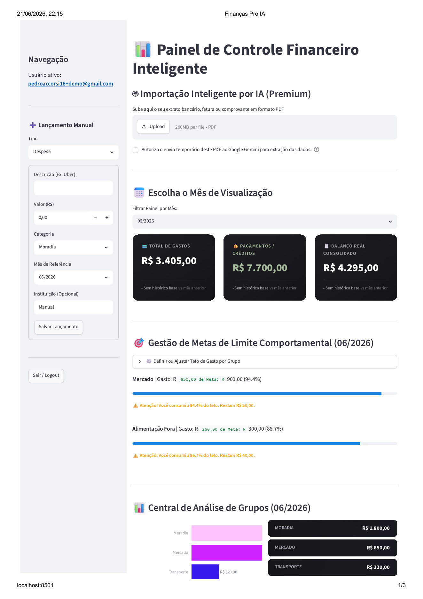
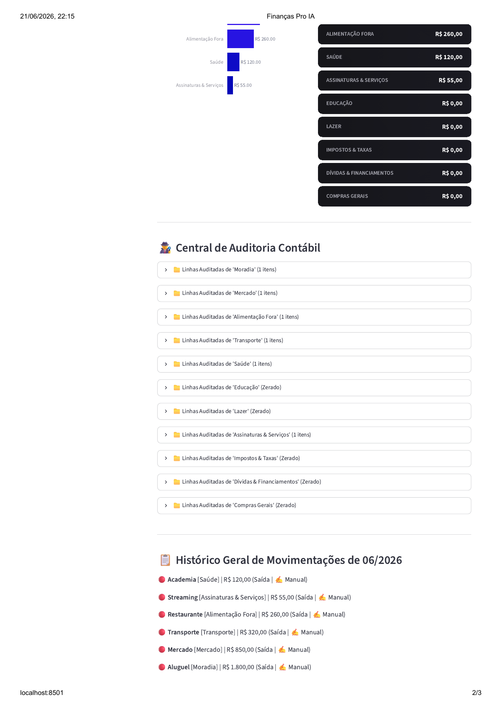
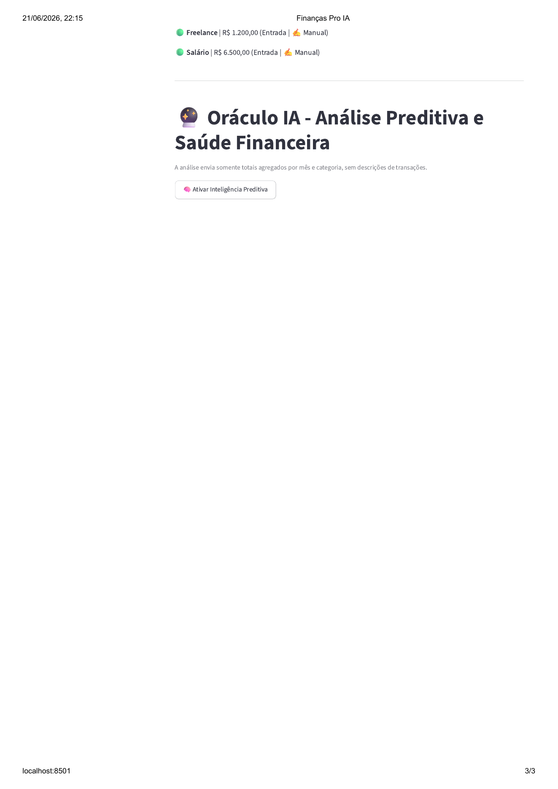
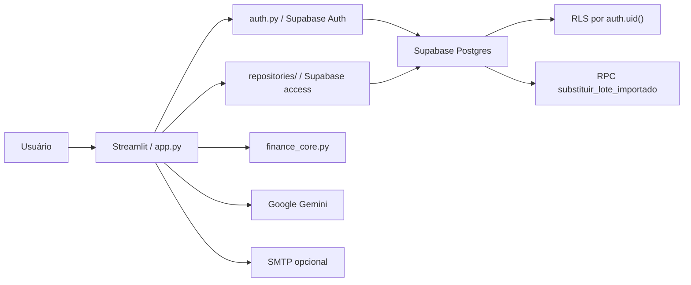

# Finanças Pro IA

Aplicação de analytics financeiro pessoal construída com **Python, Streamlit, Supabase e IA generativa**. O projeto simula um produto multiusuário em que dados financeiros são coletados, revisados, persistidos com segurança e transformados em dashboards, metas e análises assistidas por IA.

Este repositório foi preparado como portfólio técnico para demonstrar competências aplicáveis a **Marketing Analytics, Growth Analytics, Product Analytics, Marketing Ops e posições técnicas júnior**: modelagem de dados, pipeline de ingestão, validação de qualidade, dashboards, automação, segurança e uso prático de IA generativa.

## Posicionamento do produto

O produto público é focado em **finanças pessoais**: importar dados, revisar lançamentos, acompanhar receitas, despesas, metas e evolução mensal. Essa é a versão pensada para entrada no mercado, com navegação simples e pouca fricção para usuários comuns.

As frentes de **Financial Planning / Wealth Management** continuam no código como módulos avançados, mas ficam ocultas por padrão. Elas podem ser liberadas depois por feature flags, quando houver base de clientes, validação comercial ou uma oferta premium.

## Entrada pública e preços

Antes do login, o app apresenta uma página pública com proposta de valor, benefícios e planos sugeridos. A intenção é explicar o produto antes de pedir cadastro, reduzindo atrito e deixando claro o foco inicial em organização financeira pessoal.

Planos sugeridos para validação do MVP:

- Gratuito: R$ 0, com lançamentos manuais, dashboard mensal e metas por categoria.
- Pro: R$ 19,90/mês, com importação assistida, auditoria por categoria e acompanhamento mensal.
- Família: R$ 29,90/mês, com visão mais completa da organização financeira doméstica e base preparada para recursos premium.

Os preços devem ser tratados como hipótese inicial de mercado, não como tabela definitiva. A evolução natural é validar disposição de pagamento, custos de infraestrutura e retenção antes de contratar APIs pagas ou liberar módulos avançados.

## Financial Planning 360

Módulo avançado, oculto por padrão na versão pública. Quando habilitado, organiza um Perfil Financeiro 360 com diagnóstico consultivo, planejamento de aposentadoria, suitability, stress test, roadmap de metas, roteiro de reunião, matriz de estratégia patrimonial e resumo executivo exportável.

Blocos consultivos disponíveis para liberação futura:

- Perfil Financeiro 360 com renda, patrimônio, dívidas, dependentes, risco, horizonte, aposentadoria, sucessão e proteção familiar.
- Relatório Consultivo 360 com diagnóstico patrimonial, planejamento financeiro, aposentadoria, expansão patrimonial, sucessão e plano 30/60/90.
- Política de Planejamento do Cliente com objetivos priorizados, diretrizes, restrições, alertas e cadência de revisão.
- Simulação de aposentadoria por cenários conservador, moderado e arrojado, com patrimônio necessário, gap e aporte mensal estimado.
- Checklist de suitability e onboarding com pendencias, alertas, proximas perguntas e documentos sugeridos.
- Roadmap de metas financeiras por curto, médio e longo prazo.
- Stress test financeiro para choques de renda, despesas, carteira e emergencia familiar.
- Roteiro de reuniao consultiva para abertura, perguntas-chave, decisoes e fechamento.
- Matriz de estratégia patrimonial com frentes de liquidez, proteção, crescimento, aposentadoria e sucessão.
- Resumo executivo exportavel em Markdown com metodologia, premissas e limites do modelo.
- Radar de Mercado demonstrativo para acompanhar ativos em observação, com score educativo, riscos e adequação por perfil, sem recomendação individual de investimento.

## Rodar localmente

Depois de instalar as dependencias e configurar os secrets, rode:

```powershell
streamlit run app.py
```

Se estiver usando o ambiente virtual local:

```powershell
.venv\Scripts\Activate.ps1
streamlit run app.py
```

## Webhook Stripe

O Streamlit roda a interface, mas a confirmação automática de pagamento precisa de um endpoint HTTP separado para receber eventos do Stripe. O projeto inclui um endpoint ASGI minimalista em `api/stripe_webhook.py`.

Variáveis obrigatórias para o processo do webhook:

- `SUPABASE_URL`
- `SUPABASE_SERVICE_ROLE_KEY`
- `STRIPE_WEBHOOK_SECRET`
- `STRIPE_PRICE_PRO`
- `STRIPE_PRICE_FAMILIA`

Para rodar localmente:

```powershell
uvicorn api.stripe_webhook:app --host 0.0.0.0 --port 8000
```

Endpoint para configurar no Stripe:

```text
POST /stripe/webhook
```

Em produção, publique esse endpoint em uma URL HTTPS e cadastre essa URL no Stripe Dashboard. Depois copie o segredo `whsec_...` do endpoint para `STRIPE_WEBHOOK_SECRET`.

## Por que este projeto importa

Times de Analytics e Growth lidam todos os dias com dados fragmentados, inconsistentes e sensíveis: planilhas, eventos, uploads, integrações, métricas por período e regras de negócio que precisam ser auditáveis. O Finanças Pro IA aplica esse mesmo raciocínio a um domínio financeiro pessoal:

- captura dados manuais e documentos em PDF;
- usa IA para estruturar informações não padronizadas;
- exige revisão humana antes de salvar;
- organiza métricas por período, categoria e origem;
- protege dados por usuário com autenticação e RLS;
- gera análises agregadas sem enviar detalhes sensíveis desnecessários para a IA.

## Demonstração de competências

| Competência | Como aparece no projeto |
| --- | --- |
| Python | Regras de negócio, validações, tratamento de erros, testes e integração com APIs. |
| Banco de dados | Modelagem relacional, migrações SQL, constraints, chaves estrangeiras e RPC transacional. |
| Supabase | Supabase Auth, Postgres, Row Level Security e cliente por sessão. |
| IA generativa | Extração estruturada de PDFs com Gemini e análise textual baseada em dados agregados. |
| Segurança | Bloqueio de chaves privilegiadas, RLS por `auth.uid()`, validação de sessão e secret hygiene. |
| Engenharia de software | Separação parcial de domínio, utilitários, testes unitários e contratos de migração. |
| Produto | Fluxo de ingestão, revisão, dashboard, metas, feedback e roadmap explícito. |
| Analytics | Métricas por mês/categoria, auditoria de origem, acompanhamento de metas e visualização com Plotly. |

## Funcionalidades

- Cadastro, login, revalidação de sessão e logout com Supabase Auth.
- Página pública antes do login com benefícios, chamada para cadastro e preços sugeridos.
- Recuperação de senha via e-mail pelo Supabase Auth, sem revelar se a conta existe.
- Isolamento multiusuário com `user_id`, foreign keys para `auth.users` e policies RLS.
- Lançamentos manuais de receitas e despesas.
- Upload de PDFs com consentimento explícito para processamento externo.
- Extração estruturada com Google Gemini usando schema JSON controlado.
- Área de revisão para conferir dados extraídos antes da gravação.
- Persistência transacional de lotes importados via RPC no Postgres.
- Dashboard mensal com resumo financeiro, gráficos e análise por categoria.
- Gestão de metas por categoria e mês.
- Central de auditoria para rastrear linhas por categoria, origem e instituição.
- Módulos avançados ocultos por feature flag: Oráculo IA, Planejamento 360 e Radar de Mercado demonstrativo.
- Feedback de respostas da IA com anonimização parcial antes de salvar.
- Bot Fiscal opcional via SMTP para alertas de divergência.
- Testes unitários, testes de contrato SQL e suíte opt-in de integração RLS.

## Screenshots

Capturas geradas com conta e dados demonstrativos, sem informações financeiras reais.







## Arquitetura



### Componentes principais

| Camada | Arquivos | Responsabilidade |
| --- | --- | --- |
| Interface | `app.py` | Fluxos Streamlit: login, upload, dashboard, metas, IA e feedback. |
| Autenticação | `auth.py` | Supabase Auth, cliente por sessão, validação de chave e revalidação de usuário. |
| Repositórios | `repositories/` | Camada de acesso ao Supabase para transações, metas, feedbacks e RPC. |
| Domínio financeiro | `finance_core.py` | Cálculos, validação de mês, comparação de lotes e resumo agregado para IA. |
| Constantes e configuração | `finance_categories.py`, `finance_constants.py`, `app_config.py` | Categorias financeiras, tipos de transação, origens de dados e chaves de configuração. |
| Sessão | `session_state.py` | Inicialização, limpeza e encerramento de sessão Streamlit. |
| Utilitários | `utils/` | Formatação, privacidade, chamadas Gemini, observabilidade, tratamento de erros, SMTP e helpers puros de dashboard/importação. |
| Banco | `supabase/migrations/` | Migrações operacionais, RPC e endurecimento de `user_id`. |
| Documentação | `docs/modelo-dados.md` | Modelo de dados, ERD, relacionamentos e regras de segurança. |
| Qualidade | `.github/workflows/`, `tests/` | CI, secret scanning, testes unitários, contratos SQL e integração RLS opt-in. |

## Modelo de dados

O modelo relacional, o diagrama ERD e as regras de isolamento por `user_id` estão documentados em [`docs/modelo-dados.md`](docs/modelo-dados.md).

## Decisões técnicas relevantes

- **RLS como barreira real de isolamento:** a aplicação filtra por `user_id`, mas a proteção crítica fica no banco com policies baseadas em `auth.uid()`.
- **Cliente Supabase por sessão:** reduz risco de compartilhar estado autenticado entre usuários no processo Streamlit.
- **Bloqueio de chaves privilegiadas:** a aplicação rejeita `sb_secret_` e JWTs com papel diferente de `anon`.
- **Revisão humana da IA:** a IA extrai e classifica, mas o usuário revisa antes de salvar.
- **RPC transacional:** reimportações substituem somente o lote do usuário autenticado, evitando duplicação.
- **Validação antes de alterar dados:** a RPC valida parâmetros, payload vazio, tipos e consistência antes de qualquer `DELETE` ou `INSERT`.
- **Menor exposição para IA:** o assistente analítico usa agregados por mês/categoria em vez de descrições individuais.

## Stack

- Python 3.11+
- Streamlit
- Supabase Auth
- Supabase Postgres
- Row Level Security
- PL/pgSQL
- Google Gemini
- Pandas
- Plotly
- unittest

## Desafios técnicos

### Segurança em ambiente multiusuário

O desafio principal foi evitar que a identidade do usuário dependesse apenas de parâmetros enviados pelo cliente. A solução combina Supabase Auth, `auth.uid()`, `user_id` nas tabelas operacionais e testes de RLS contra leitura, escrita, update, delete e RPC com identidade forjada.

### IA generativa com controle humano

Documentos financeiros podem ter formatos variados e classificações incertas. Por isso, a aplicação usa Gemini para estruturar dados, mas mantém uma etapa de revisão antes de gravar no banco.

### Reimportação sem duplicidade

Um mesmo documento pode ser importado mais de uma vez. A RPC `substituir_lote_importado` compara e substitui lotes por usuário, mês, instituição e tipo de documento.

### Privacidade nos recursos de análise

O assistente de análise não precisa receber descrições individuais. O projeto resume o histórico em totais agregados por mês e categoria, reduzindo exposição de dados sensíveis.

## O que é defensável em entrevista

Este projeto permite explicar, com base no código:

- como autenticação e autorização são separadas;
- por que RLS é importante em aplicações multi-tenant;
- como uma RPC reduz risco de duplicidade e inconsistência;
- como validar dados de IA antes de persistir;
- como transformar eventos financeiros em métricas de dashboard;
- como escrever testes de contrato para migrações SQL;
- quais limitações existem e como evoluir a arquitetura.

## Limitações conhecidas

- `app.py` ainda concentra parte relevante da UI e da orquestração, embora a camada Supabase, categorias, constantes, configuração e estado de sessão já tenham sido extraídos em módulos dedicados.
- A autorização administrativa ainda depende de `ADMIN_EMAILS`.
- A suíte RLS real exige um projeto Supabase de teste e execução opt-in.

Essas limitações são intencionais para um projeto de portfólio em evolução e formam parte do roadmap técnico.

## Estrutura
```text
app.py                  Interface e orquestração Streamlit
auth.py                 Autenticação Supabase e cliente por sessão
repositories/           Acesso ao Supabase e RPCs
finance_core.py         Regras financeiras puras
finance_categories.py   Categorias válidas de receitas e despesas
finance_constants.py    Tipos de transação, origens e documentos
app_config.py           Chaves de configuração usadas pela aplicação
session_state.py        Inicialização e limpeza do estado de sessão Streamlit
utils/                  Utilitários de privacidade, observabilidade, formatação, IA, SMTP e helpers de dashboard/importação
supabase/migrations/    Migrações operacionais do banco
tests/                  Testes unitários, contratos e integração opt-in
docs/modelo-dados.md    ERD, dicionário de dados e regras de segurança
docs/screenshots/       Espaço para imagens demonstrativas
```

## Instalação

1. Crie e ative um ambiente virtual.

```powershell
python -m venv .venv
.venv\Scripts\Activate.ps1
```

2. Instale as dependências.

```powershell
pip install -r requirements.txt
```

3. Configure os secrets.

Copie `.streamlit/secrets.example.toml` para `.streamlit/secrets.toml` e preencha com valores reais somente no ambiente local ou no provedor de deploy.

Também há `.env.example` para plataformas que usam variáveis de ambiente.

4. Aplique as migrações no Supabase.

Revise os arquivos em `supabase/migrations/` e aplique em ambiente controlado.

5. Rode a aplicação.

```powershell
streamlit run app.py
```

## Variáveis de configuração

Obrigatórias:

- `SUPABASE_URL`
- `SUPABASE_KEY`
- `GEMINI_API_KEY`

Opcionais:

- `ADMIN_EMAILS`
- `ENABLE_PLANEJAMENTO_360`
- `ENABLE_MARKET_RADAR`
- `ENABLE_ORACULO_IA`
- `SMTP_SERVER`
- `SMTP_PORT`
- `SMTP_EMAIL_REMETENTE`
- `SMTP_SENHA_REMETENTE`
- `EMAIL_DESTINATARIO_ALERTAS`

## Testes

Para uma checagem local completa do projeto:

```powershell
.\scripts\check.ps1
```

Esse comando valida a estrutura basica, compila os modulos Python e roda a suite local de testes.

Para rodar somente os testes diretamente:

```powershell
python -m unittest discover -s tests -v
```

A suíte real de integração RLS é opt-in e exige um projeto Supabase não produtivo com dois usuários de teste:

```powershell
python -m unittest tests.integration.test_supabase_rls -v
```

Veja `tests/integration/README.md` antes de executar.

## Segurança

- Nunca versione `.env`, `.streamlit/secrets.toml`, dumps, backups, uploads, PDFs, planilhas, logs ou credenciais reais.
- A aplicação deve usar somente chave Supabase pública/publishable ou anon.
- Chaves `service_role`, `sb_secret_`, tokens privados e senhas devem existir apenas em ambientes seguros.
- Antes de publicar forks ou releases, rode secret scanning e revise o histórico Git.

## Roadmap

Veja tambem a fila priorizada em [`docs/proximas-tarefas.md`](docs/proximas-tarefas.md).

- Criar um vídeo curto de demonstração do fluxo completo.
- Criar testes end-to-end para os principais fluxos Streamlit.
- Mover autorização administrativa para claims ou tabela protegida por RLS.
- Avaliar qualidade das extrações por IA com casos de teste anonimizados.

Concluído recentemente:

- Adicionar CI com testes e secret scanning.
- Extrair camada de repositórios Supabase para reduzir acoplamento em `app.py`.
- Extrair categorias, constantes financeiras, configuração SMTP e estado de sessão para módulos dedicados.
- Extrair helpers puros de importação, lançamentos manuais, tendências, metas e análise por categoria.
- Melhorar observabilidade para erros de IA, SMTP e banco.
- Criar documentação do modelo de dados com diagrama ERD.
- Adicionar screenshots reais com dados demonstrativos.

## Status do projeto
Projeto em versão publicável para portfólio técnico. O foco é demonstrar raciocínio de produto, analytics, segurança multiusuário, integração com IA generativa e boas práticas de publicação sem credenciais reais.
