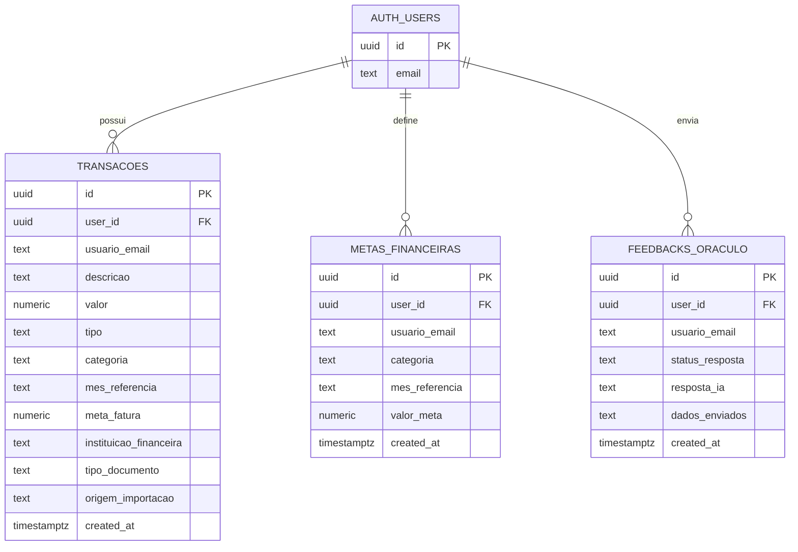

# Modelo de Dados

Este documento descreve o modelo relacional usado pelo Financas Pro IA no Supabase. O foco do modelo e manter dados financeiros isolados por usuario autenticado, com `auth.users.id` como identidade canonica e `usuario_email` apenas como compatibilidade/auditoria humana.

## ERD

## Tabelas

### `auth.users`

Tabela gerenciada pelo Supabase Auth. A aplicacao nao grava diretamente nela.

| Campo | Papel |
| --- | --- |
| `id` | Identidade canonica usada em `user_id`. |
| `email` | E-mail autenticado retornado pelo Supabase Auth. |

### `public.transacoes`

Armazena lancamentos manuais e transacoes extraidas de documentos por IA.

| Campo | Papel |
| --- | --- |
| `id` | Identificador da transacao. |
| `user_id` | Dono do registro. Deve corresponder a `auth.uid()`. |
| `usuario_email` | Campo de compatibilidade/auditoria; nao e autoridade de seguranca. |
| `descricao` | Descricao da compra, credito ou lancamento. |
| `valor` | Valor positivo da transacao. |
| `tipo` | `Despesa` ou `Receita`. |
| `categoria` | Categoria financeira usada em dashboard e metas. |
| `mes_referencia` | Periodo no formato `MM/AAAA`. |
| `meta_fatura` | Total declarado do documento importado; `0` para movimentos manuais. |
| `instituicao_financeira` | Banco, cartao ou origem financeira. |
| `tipo_documento` | Tipo do documento/lancamento, como `Manual` ou `Fatura`. |
| `origem_importacao` | `Manual` ou `Automatico`, conforme fluxo de entrada. |
| `created_at` | Data de criacao, usada para ordenacao no app. |

### `public.metas_financeiras`

Armazena teto de gasto por categoria e mes.

| Campo | Papel |
| --- | --- |
| `id` | Identificador da meta. |
| `user_id` | Dono da meta. Deve corresponder a `auth.uid()`. |
| `usuario_email` | Compatibilidade/auditoria. |
| `categoria` | Categoria de despesa monitorada. |
| `mes_referencia` | Periodo no formato `MM/AAAA`. |
| `valor_meta` | Valor limite definido pelo usuario. |
| `created_at` | Data de criacao. |

Regra de aplicacao: o upsert usa conflito por `user_id,categoria,mes_referencia`, garantindo uma meta por usuario, categoria e mes.

### `public.feedbacks_oraculo`

Registra avaliacao do usuario sobre respostas da IA, com conteudo anonimizado antes da persistencia.

| Campo | Papel |
| --- | --- |
| `id` | Identificador do feedback. |
| `user_id` | Dono do feedback. Deve corresponder a `auth.uid()`. |
| `usuario_email` | Compatibilidade/auditoria. |
| `status_resposta` | Avaliacao do usuario, como `TOP` ou `RUIM`. |
| `resposta_ia` | Resposta da IA apos anonimizacao parcial. |
| `dados_enviados` | Dados agregados enviados para IA, tambem anonimizados. |
| `created_at` | Data de criacao. |

## Relacionamentos e isolamento

As tres tabelas publicas operacionais se relacionam com `auth.users` por `user_id`:

- `public.transacoes.user_id -> auth.users.id`
- `public.metas_financeiras.user_id -> auth.users.id`
- `public.feedbacks_oraculo.user_id -> auth.users.id`

A aplicacao sempre filtra registros por `user_id`, mas a barreira principal de seguranca deve ficar no Supabase via RLS baseada em `auth.uid()`.

## RPC `public.substituir_lote_importado`

A RPC substitui um lote importado por IA de forma transacional. O lote e identificado por:

- `p_user_id`
- `p_mes_referencia`
- `p_instituicao_financeira`
- `p_tipo_documento`

A versao endurecida valida antes de mutar dados:

- usuario autenticado via `auth.uid()`;
- `p_user_id` igual ao usuario autenticado;
- mes no formato `MM/AAAA`;
- instituicao e tipo de documento nao vazios;
- payload JSON como array nao vazio;
- campos obrigatorios, tipos e valores de cada item;
- consistencia de mes, instituicao, tipo de documento e origem do lote.

Depois da validacao, a RPC remove apenas o lote daquele usuario e reinsere as transacoes recebidas. O `usuario_email` e derivado preferencialmente do JWT (`auth.jwt()`), mantendo compatibilidade sem ser usado como autoridade.

## Regras de seguranca esperadas

- `user_id` e obrigatorio em `transacoes`, `metas_financeiras` e `feedbacks_oraculo`.
- `user_id` deve apontar para um usuario existente em `auth.users`.
- A aplicacao deve usar apenas chave Supabase anon/public ou publishable.
- Chave `service_role`/`sb_secret_` nunca deve ser usada no app Streamlit.
- RLS deve bloquear `SELECT`, `INSERT`, `UPDATE`, `DELETE` e RPC sem sessao autenticada ou com identidade forjada.

## Observacao sobre migrations

As migrations versionadas neste repositorio publico documentam principalmente a evolucao operacional do modelo: endurecimento da RPC `substituir_lote_importado` e endurecimento de `user_id` para `NOT NULL`. O DDL inicial das tabelas deve existir no projeto Supabase de origem ou em uma migration anterior nao incluida neste recorte publico.
